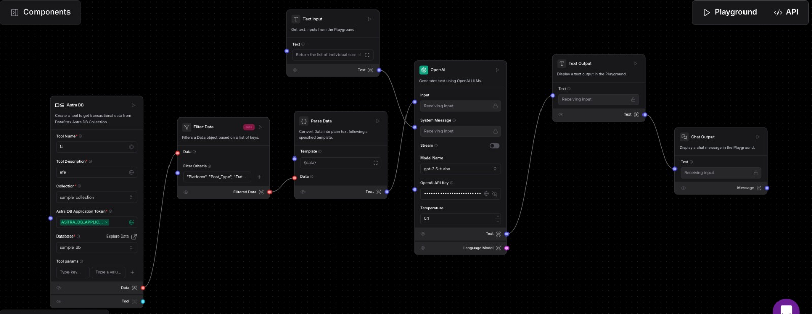

# SuperMind

## Overview

### Deployed Link: [🔴Live](https://ethereum-bots-supermind-hackathon.vercel.app)

### YouTube Video: [Watch Here](https://www.youtube.com/watch?v=ilVoZxCWQpk)

---

<div style="font-size: 1.2em;">

**Supermind Analytics** is a comprehensive solution designed to provide advanced analytics and insights on social media engagement.

In today's digital age, understanding social media engagement is critical for effective marketing strategies. However, analyzing diverse content formats and their impact on engagement often requires complex and expensive tools. This project addresses the gap by offering an affordable, streamlined solution that provides clear insights into post performance, enabling businesses and creators to optimize their content strategy.

Whether you're analyzing likes, shares, or comments, our tool helps you focus on what matters—delivering results that drive success in the competitive digital space.

</div>

## LangFlow Graph View

<div style="text-align: center;">
      
</div>

---

## Landing Page [🔴Live Link](https://ethereum-bots-supermind-hackathon.vercel.app)

<div style="text-align: center;">
      
</div>

## Ask anything about the data and get insights, comparisons, and recommendations in seconds!

<div style="text-align: center;">
      
</div>

## Query the data with a simple question and get detailed reports with actionable insights!

<div style="text-align: center;">
      
</div>

## Get detailed reports with insights, comparisons, and recommendations for your social media posts!

<div style="text-align: center;">
      
</div>

## Features

- RESTful API endpoints
- Data validation and error handling
- Integration with Langflow and AstraDB
- Scalable and efficient data processing
- Detailed reports with insights and recommendations
- User-friendly interface for querying data

## Installation

1. Clone the repository:
      ```bash
      git clone https://github.com/Prayag2003/ethereum-bots-supermind-hackathon
      ```
2. Navigate to the project directory:
      ```bash
      cd ethereum-bots-supermind-hackathon
      ```
3. Install dependencies:
      ```bash
      cd backend/src
      python -m venv .venv
      ```
4. Activate the virtual environment:

      ```bash
      # For Windows
      source .venv/Scripts/activate

      # For MacOS/Linux
      source .venv/bin/activate
      ```

5. Swagger Docs available at:
      ```bash
      https://ethereum-bots-supermind-hackathon.onrender.com/docs
      ```

## Usage

1. Start the development server:
      ```bash
      uvicorn main:app --host 0.0.0.0 --port 8000 --reload
      ```
2. Access the API at `https://ethereum-bots-supermind-hackathon.onrender.com/query`

3. Swagger Docs available at:
      ```bash
      https://ethereum-bots-supermind-hackathon.onrender.com/docs
      ```

### Parameters

**JSON Body:**

1. ENDPOINT
   `https://ethereum-bots-supermind-hackathon.onrender.com/query`

```json
{
	"post_type": "Video",
	"query": "What is the increase in number of likes of images than videos?"
}
```

### Response

```json
{
	"report": "Based on the data provided, the average number of Likes for videos is 524.26, while the average number of Likes for images is 456.85. This results in a percentage difference of 14.76%, indicating that videos receive, on average, 14.76% more Likes compared to images.\n\nInsights:\n- Videos tend to receive a higher average number of Likes compared to images, with a noticeable difference of 14.76%.\n- This suggests that the audience is more engaged with video content, as indicated by the higher average Likes for videos.\n- To enhance engagement further, focusing on video content creation and optimization may be beneficial, given the higher Engagement Rate for videos as well.\n\nOverall, videos appear to be more effective in garnering Likes and engagement compared to images, highlighting the importance of incorporating video content strategies in social media posts."
}
```

## OUTPUT:

<div style="text-align: center;">
      
</div>
